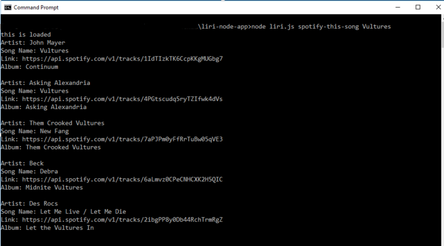

# liri-node-app

This is a Node.js command line application that allows the user to enter four different commands:
* *concert-this [artist/band name here]*
    
* *spotify-this-song [song name here]*
    
* *movie-this [movie name here]*
    
* *do-what-it-says*
    

APIs used for this project were:
* Spotify
* Bands In Town
* OMDb

Node Packages used:
* axios
* fs
* node-spotify-api
* moment

